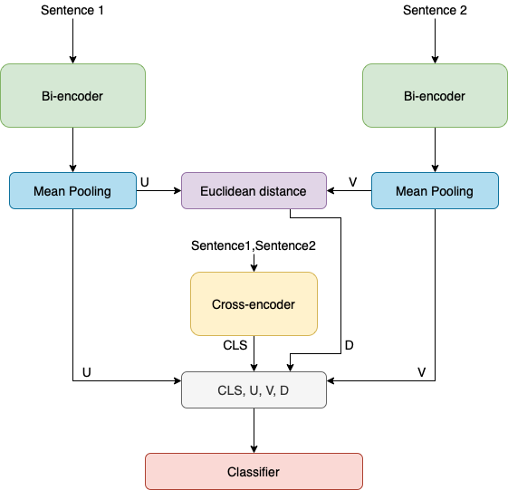

# Sentence-CROBI: A Simple Cross-Bi-Encoder-Based Neural Network Architecture for Paraphrase Identification

This repository contains the official implementation of [Sentence-CROBI: A Simple Cross-Bi-Encoder-Based Neural Network Architecture for Paraphrase Identification](https://www.mdpi.com/2227-7390/10/19/3578).

